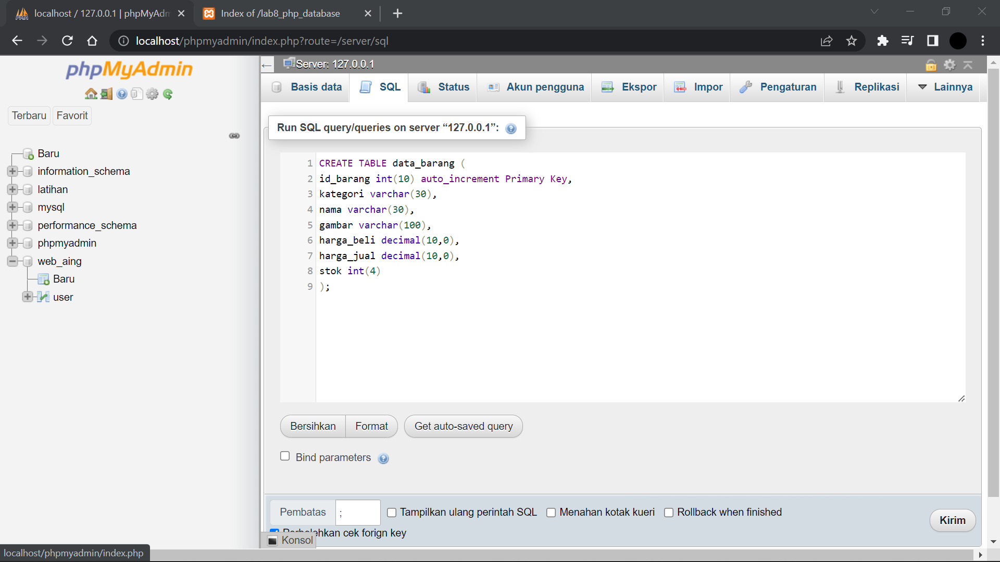
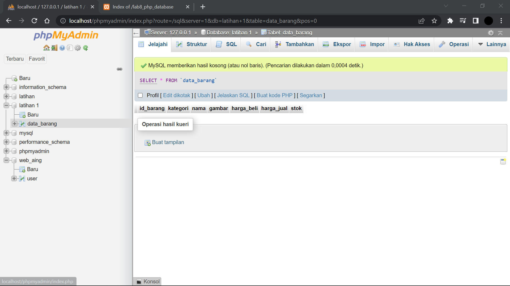
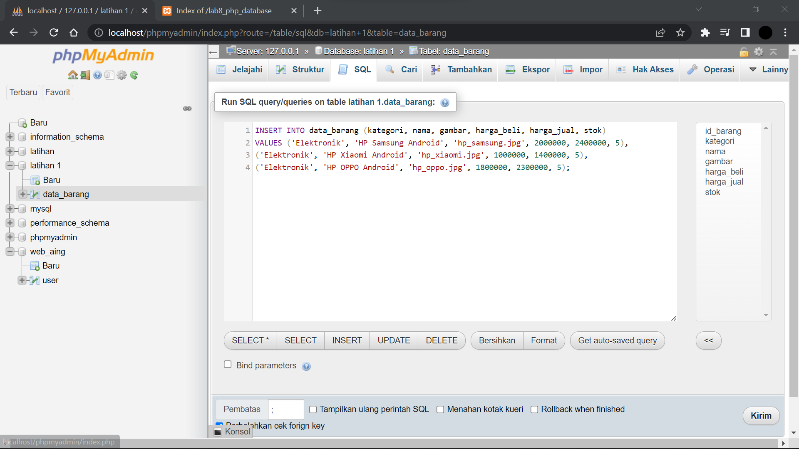
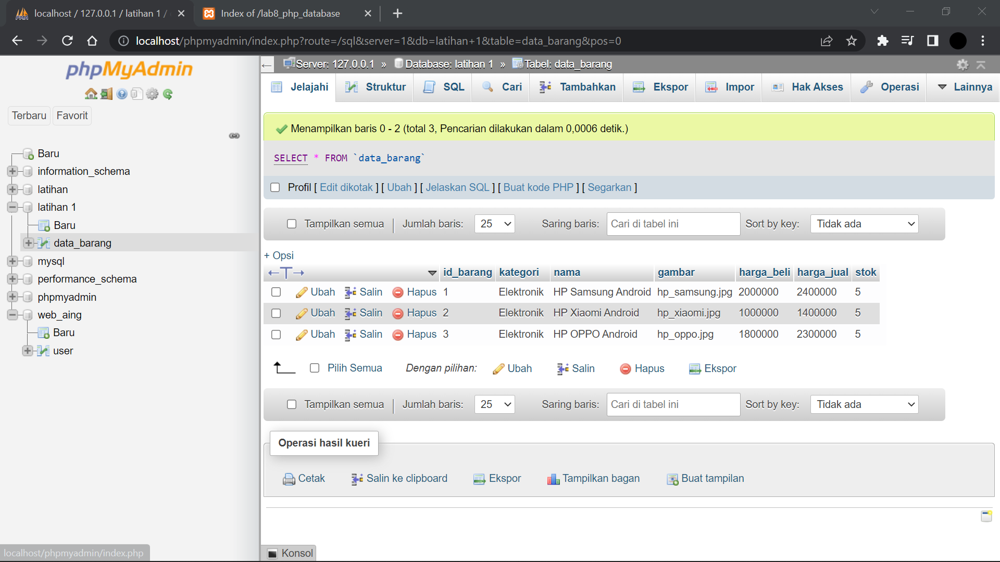
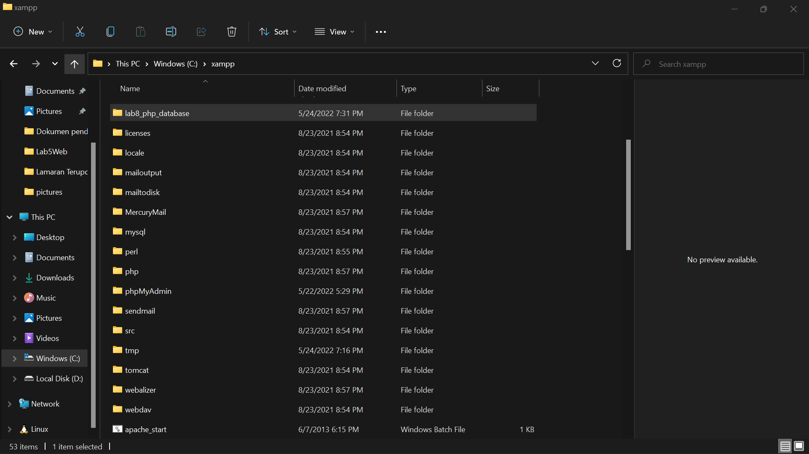
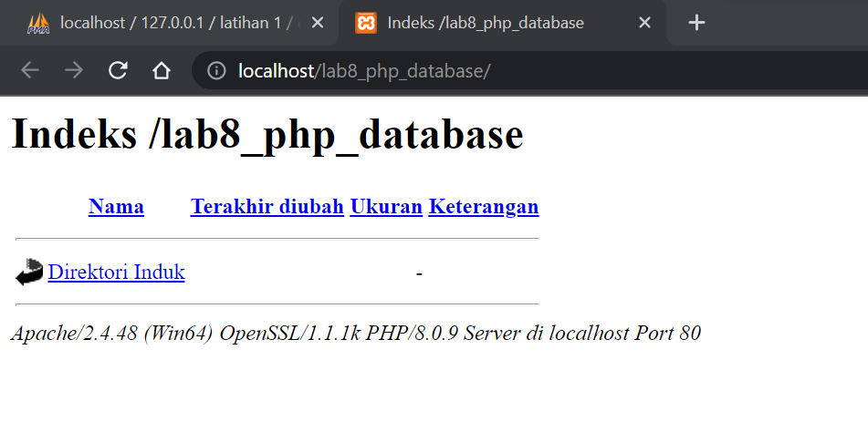

# Lab8Web
## Tugas Pemograman Web - pertemuan 10 Praktikum 8

<table border="1" cellpadding="6" cellspacing="2">
            <thead>
            <tr>
            <th>Nama </th>
            <th>Ahmad Muafiq</th>
            </tr>
            </thead>
            <tbody>
            <tr>
            <td>NIM </td>
            <td >312010152</td>
            </tr>
            <tr>
            <td>Kelas </td>
            <td>TI.20.B1</td>
            </tbody>
            </table>

## Tugas Pemograman Web - pertemuan 6 Praktikum 5

# Persiapan
** Untuk memulai membuat aplikasi CRUD sederhana, yang perlu disiapkan adalah
database server menggunakan MySQL. Pastikan MySQL Server sudah dapat dijalankan
melalui XAMPP. **

1. Membuat Database: Studi Kasus Data Barang
   
 
 

2. Membuat isi dari tabel data bsae yang telah dibuat.
kemudian tambahkan isi dari tabel tersebut seperti pada gambar dibawah.

 
 

3. Membuat Program CRUD
   Buat folder lab8_php_database pada root directory web server (c:\xampp\htdocs) seperti pada gambar berikut.

    

4. Kemudian untuk mengakses direktory tersebut pada web server dengan mengakses URL:
http://localhost/lab8_php_database/  maka tampilanya akan seperti pada gambar dibawah ini.

 